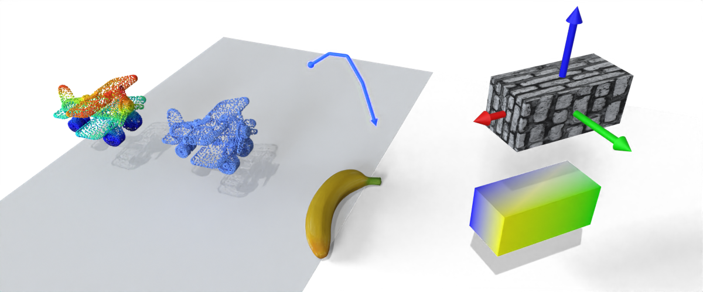
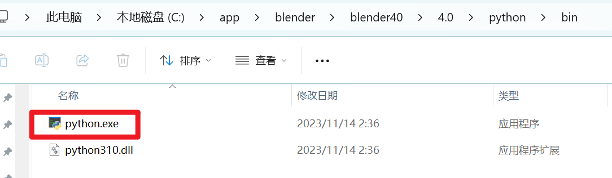

## Some blender python functions for 3D graphics data rendering




## Introduction
Some simple tools to load models and render the scene

support Blender 3.0+

[中文版使用简介](./doc/how_to_use.md)

### ⚠️⚠️⚠️ 
Hey guys, I strongly recommend using [BlenderToolbox](https://github.com/HTDerekLiu/BlenderToolbox/), it is easy to use, and there are a lot of scripts in the [demo](https://github.com/HTDerekLiu/BlenderToolbox/tree/master/demos)!

## Update note

> 2024.01.18

* 根据blender 4调整了一些函数，加了动画等新模块，加了一个中文的简易使用说明

> 2022.12.21

* 作为课程助教的时候做了一份简单的blender入门指南，有兴趣的话欢迎下载来看看：
  
  ppt与文件下载链接: https://pan.baidu.com/s/1vOHMwOzvhZpCtMbjGkI24g 
  提取码: 6mfz 

<details>
> 2022.12.08
* Now blender 3.0+ already support better point cloud visualization based on geometry node

> 2022.02.17
1. update rgb point cloud (very good, faster than point_cloud_visualizer addon!!!)
2. color the object surface based on vertex colors

> 2022.02.08

1. add collection management
2. add curve
3. add rgb point cloud (no good, but don't need point_cloud_visualizer addon)
4. reorganize the code
</details>

## Dependencies
If you want to render point cloud data (`ply` format), you need to install `trimesh` in blender, open a terminal and execute the following command:

1. go to the python folder of your blender: 



2. install same package we need :

```
python.exe -m pip install trimesh

python.exe -m pip install bpycv
```

## Usage

Before you run `demo.py`, please modify the `ROOT_DIR` at line 14 to your folder path, then run: 

```
blender -b -P demo.py
```

Or you can open the `demo.blend` and modify the `ROOT_DIR` to run the script, then you can see the result in blender.

### Wishlist

* compose about shadow
* more curve
* volume render


## Acknowledgements
Learn from 
* [bpycv](https://github.com/DIYer22/bpycv)
* [point_cloud_render](https://github.com/itsumu/point_cloud_renderer)
* [point_cloud_visualizer](https://github.com/uhlik/bpy)

and thanks to these blogs:
* [create uv map](https://b3d.interplanety.org/en/how-to-create-a-new-mesh-uv-with-the-blender-python-api/)
* [get vertices](https://blenderartists.org/t/efficient-copying-of-vertex-coords-to-and-from-numpy-arrays/661467/2)
