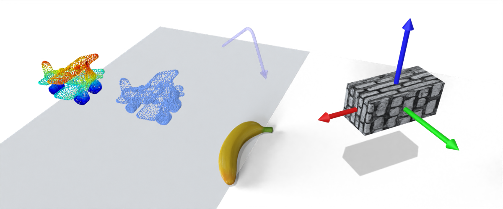

## Some blender python functions for 3D graphics data rendering




## Introduction
Some simple tools to load models and render the scene

support point cloud and mesh

support Blender 3.0+

## Update note
> 2022.02.17
1. update rgb point cloud (very good, faster than point_cloud_visualizer addon!!!)
2. color the object surface based on vertex colors
> 2022.02.08
1. add collection management
2. add curve
3. add rgb point cloud (no good, but don't need point_cloud_visualizer addon)
4. reorganize the code

## Dependencies
If you want to render point cloud data (`ply` format), you need to install `trimesh` in blender:
```
# Get pip: equl to /blender-path/2.xx/python/bin/python3.7m -m ensurepip
blender -b --python-expr "__import__('ensurepip')._bootstrap()" 
# Update pip toolchain
blender -b --python-expr "__import__('pip._internal')._internal.main(['install', '-U', 'pip', 'setuptools', 'wheel'])"
# pip install numpy, scipy, trimesh, and PIL
blender -b --python-expr "__import__('pip._internal')._internal.main(['install', '-U', 'trimesh'])"
blender -b --python-expr "__import__('pip._internal')._internal.main(['install', '-U', ' scipy'])"
blender -b --python-expr "__import__('pip._internal')._internal.main(['install', '-U', ' pillow'])"
# pip install bpycv
blender -b --python-expr "__import__('pip._internal')._internal.main(['install', '-U', 'bpycv'])"
```

## Usage

Before you run `demo.py`, please mordify the `ROOT_DIR` at line 14 to your folder path, then run: 

```
blender -b -P demo.py
```

## Acknowledgements
Learn from 
* [bpycv](https://github.com/DIYer22/bpycv)
* [point_cloud_render](https://github.com/itsumu/point_cloud_renderer)
* [point_cloud_visualizer](https://github.com/uhlik/bpy)

and thanks to these blogs:
* [create uv map](https://b3d.interplanety.org/en/how-to-create-a-new-mesh-uv-with-the-blender-python-api/)
* [get vertices](https://blenderartists.org/t/efficient-copying-of-vertex-coords-to-and-from-numpy-arrays/661467/2)
