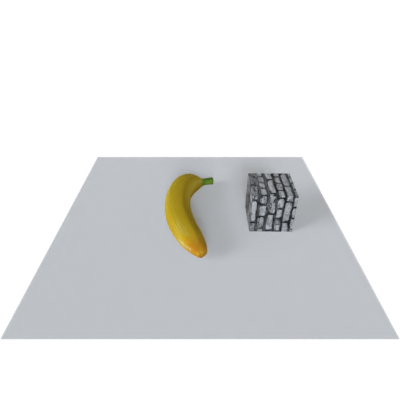
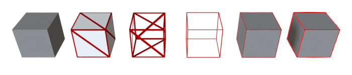

## Some blender python functions for 3D graphics data rendering


## Introduction
Some simple tools to load models and render the scene

support Blender 3.0+


[What can they do](#what-can-they-do) | [Dependencies](#dependencies) | [Usage](#usage) | [中文版使用简介](./doc/how_to_use.md)

### ⚠️⚠️⚠️ 
Hey guys, I strongly recommend using [BlenderProc](https://github.com/DLR-RM/BlenderProc/tree/main) and [BlenderToolbox](https://github.com/HTDerekLiu/BlenderToolbox/), they are easy to use, and there are a lot of scripts in the [demo](https://github.com/HTDerekLiu/BlenderToolbox/tree/master/demos)

作为课程助教的时候做了一份简单的blender入门指南，有兴趣的话欢迎下载来看看：

ppt与文件下载链接: https://pan.baidu.com/s/1vOHMwOzvhZpCtMbjGkI24g  | 提取码: 6mfz 

## What can they do

Task | Example | Result
--- | --- | ---
Set your models and light, then render. | [`demo.py`](./demo.py)   | <p align='center'> </p>
Rotate your scene, render animation. | [`animation.py`](./examples/animation.py)   | <p align='center'> </p>
Render object with wireframe. | [`wireframe.py`](./examples/wireframe.py)   | <p align='center'> </p>
Clean the overlap surface of model. | [`clean_double_faces()`](./tools/modifier.py#L65)   | <p align='center'> </p>
Visulize the intersect edges of two objects. | [`show_intersection_lines()`](./tools/modifier.py#L91)   | <p align='center'> </p>
Convert image sequence into video. | [`img_to_video.py`](./examples/img_to_video.py)  


## Dependencies
If you want to render point cloud data (`ply` format), you need to install `trimesh` in blender, open a terminal and execute the following command:

1. go to the python folder of your blender: 


2. install same package we need :

```
python.exe -m pip install trimesh

python.exe -m pip install bpycv
```

## Usage

Before you run `demo.py`, please modify the `ROOT_DIR` at line 14 to your folder path, then run: 

```
blender -b -P demo.py
```

Or you can open the `demo.blend` and modify the `ROOT_DIR` to run the script, then you can see the result in blender.


## Wishlist

* copy scene addon!!!
* compose about shadow
* more curve
* volume render


## Acknowledgements
Learn from 
* [bpycv](https://github.com/DIYer22/bpycv)
* [point_cloud_render](https://github.com/itsumu/point_cloud_renderer)
* [point_cloud_visualizer](https://github.com/uhlik/bpy)

and thanks to these blogs:
* [create uv map](https://b3d.interplanety.org/en/how-to-create-a-new-mesh-uv-with-the-blender-python-api/)
* [get vertices](https://blenderartists.org/t/efficient-copying-of-vertex-coords-to-and-from-numpy-arrays/661467/2)
