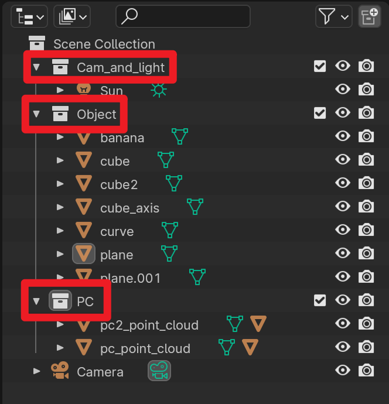
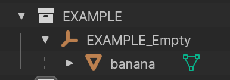

## 如何使用这些函数进行渲染（配合demo.py观看)

<!--  -->

### 渲染场景的基本流程
1. 清空场景。
2. 导入模型。
3. 添加相机。
4. 添加光照。
5. 设置渲染参数。
6. 渲染图片。

### 基本模块
`tools`文件夹内提供的几个文件基本对应着上面的步骤：

`scene.py`：对整个场景进行管理，包括清空场景、将物体归类到一个集合（collection）等操作

`models.py`：与模型相关的函数，包括各类网格和点云的加载、几何体的创建

`material.py`：与模型材质相关的函数，主要是在models被调用

`lighter.py`：与光照相关的函数，主要用来加载光源

`viewer.py`：与相机相关的函数，添加相机

`render.py`：与渲染相关的函数，设置渲染参数，进行渲染

    !!! 其中一些代码需要将软件设置为英文才能使用，因为有的参数名称会随着默认语言变化而相应变化

### 跑代码前的准备
找到blender文件夹的python文件，我们的代码都是用这个python执行的，参考 `README.md` 的命令安装两个库，trimesh是用来读取点云的，第二个是一个blender的第三方视觉库，可以用来生成实例分割图、深度图等，不过这里安装它只是因为它能帮忙把一些常用的python库也一起安装了（比如numpy和matplotlib）

然后稍微了解一下blender的操作方式

### 简单的使用场景
`demo.py` 中展示了一个创建场景、导入模型到渲染出图的过程，参照自己的需求使用需要的模型加载函数，设置自己需要的相机位置和渲染分辨率。

然后我们可以在不打开blender的情况下，直接用命令行执行：

```blender.exe -b -P demo.py```

你也可以自己在某个地方写一个python文件，调用这里的函数，只要确保 `ROOT_DIR` 这个变量是指向这个函数文件夹就行，但这样没法直接看到自己修改的效果，调整场景参数很麻烦，这个方式最适合的是整体参数设置好，进行批量渲染的时候使用。

设置自己需要的渲染场景时，还是建议打开blender，或者在这里提供的 `demo.blend` 中执行代码（记得先把渲染的函数注释掉，因为还没必要渲染图片），这样可以直接在界面中看到代码执行的效果。具体的blender操作可以参照 `README.md` 中分享的ppt。

自己设置好大致的场景摆放参数后，将这些位置、角度数值写进代码，这时候就可以加个for循环什么的让其自动化执行了。

### 稍微复杂点的使用场景
有些时候，我们需要渲染场景的多个视角，直接的想法是我们设置几组相机位置，绕场景一圈拍照渲染就行了，但在光源不动的情况下，这样会得到光照效果不同的几组图，没法用于展示。

如果光源也随着相机旋转，设置会更加麻烦，所以更简单的方式是让场景物体绕着一个Z轴旋转，这样相机和光源都不用修改了。

但我们场景中可能有多个模型组合，为了确保大家都能绕着同一个轴旋转，代码中实现了一个功能：将多个物体设置为一个坐标轴对象的子物体，这样我们旋转平移这个父坐标轴对象的时候，作为子物体的场景都能同时旋转平移。

在blender中我们可以将多个物体设置为同个集合来管理，下面是 `demo.py` 执行后会创建的一些物体，我们从场景列表中可以看到这些物体属于不同的白色盒子图标下，这些白色盒子图标表示的就是不同的collection，

<center></center>

而 `demo.py` 中的 `add_models_example` 函数，它使用到了一个装饰器 `scene.add_model_in_collection`，这个装饰器的作用是将我们写的函数内添加的物体都放入一个集合collection当中，并创建一个坐标系对象，将这些物体都设置为它的子物体。这个函数执行后得到的结果如下图：

<center></center>


可以看见使用了装饰器来添加物体的话，这些物体不是直接位于集合的第一层，而是作为一个坐标轴对象（EXMAPLE_Empty）的子物体加入了场景，这样的好处是我们通过控制这个坐标轴对象就可以让这个场景中所有物体同步位移旋转和缩放。

希望这个装饰器起作用的话，需要在函数的参数内加一个叫做 `collection_name` 的参数，设置为你想要的集合名字。